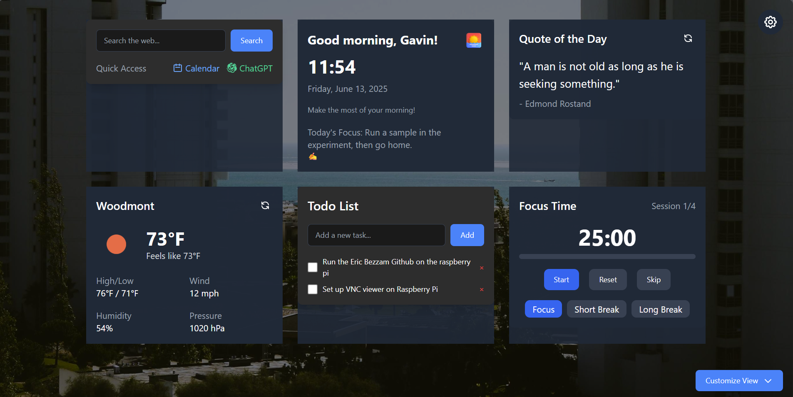

# ImprovEdge New Tab

A beautiful and productive new tab page for Microsoft Edge with weather updates, task management, inspirational quotes, and a Pomodoro timer.



## 🌟 Features

### 1. Weather Widget
- Real-time weather updates with location detection
- Temperature display in Fahrenheit/Celsius
- High/low temperature display
- Wind speed in mph/km/h
- 3-hour location caching for efficiency

### 2. Welcome Flow
- Personalized daily setup
- Name storage for greetings
- Daily task prompts
- Pomodoro timer integration
- Smart task management

### 3. Widget Controls
- Show/hide individual widgets
- "Show All" and "Show Only Time" options
- Customizable widget visibility
- Intuitive interface

### 4. Settings
- Comprehensive settings modal with categories:
  * Pomodoro (focus/break durations, auto-start)
  * Weather (units, location, updates)
  * Quotes (categories, frequency)
  * Layout (widget positioning)
  * Global (username, time format, theme)
- Import/export functionality
- Reset to defaults option

### 5. Visual Design
- 4K wallpaper support (3840x2160)
- Minimal blur for readability
- Modern UI components
- Smooth transitions

## 🚀 Quick Start

1. Clone the repository:
```bash
git clone https://github.com/yourusername/improvedge-new-tab.git
cd improvedge-new-tab
```

2. Install dependencies:
```bash
npm install
```

3. Create a `.env` file with your API keys:
```env
WEATHER_API_KEY=your_openweathermap_api_key
QUOTES_API_KEY=your_quotes_api_key
```

4. Build the extension:
```bash
npm run build
```

5. Load the extension in Edge:
- Open Edge and go to `edge://extensions/`
- Enable "Developer mode"
- Click "Load unpacked"
- Select the `build` folder

6. Set as your new tab page:
- Open Edge Settings
- Go to "Start, home, and new tabs"
- Under "New tab page", select "ImprovEdge New Tab"

## 💻 Development

1. Start the development server:
```bash
npm run dev
```

2. Make your changes
3. Build for production:
```bash
npm run build
```

## ⚙️ Configuration

### Weather Widget
- Units: Choose between imperial (°F) and metric (°C)
- Location: Auto-detect or manually set
- Update frequency: Configure how often to fetch new data

### Pomodoro Timer
- Focus duration: Set your work session length
- Break duration: Configure short and long breaks
- Sessions until long break: Customize your work cycle
- Auto-start options: Choose to auto-start breaks and sessions

### Quotes
- Categories: Select from motivational, technical, trivia, and more
- Update frequency: Choose hourly, daily, or weekly updates
- Keywords: Include or exclude specific topics

### Theme
- Choose between light and dark modes
- Customize widget appearance
- Set wallpaper preferences

## 🤝 Contributing

1. Fork the repository
2. Create your feature branch: `git checkout -b feature/AmazingFeature`
3. Commit your changes: `git commit -m 'Add some AmazingFeature'`
4. Push to the branch: `git push origin feature/AmazingFeature`
5. Open a Pull Request

## 📝 License

This project is licensed under the MIT License - see the [LICENSE](LICENSE) file for details.

## 🙏 Acknowledgments

- OpenWeatherMap API for weather data
- Quotable API for inspirational quotes
- Picsum for beautiful wallpapers 